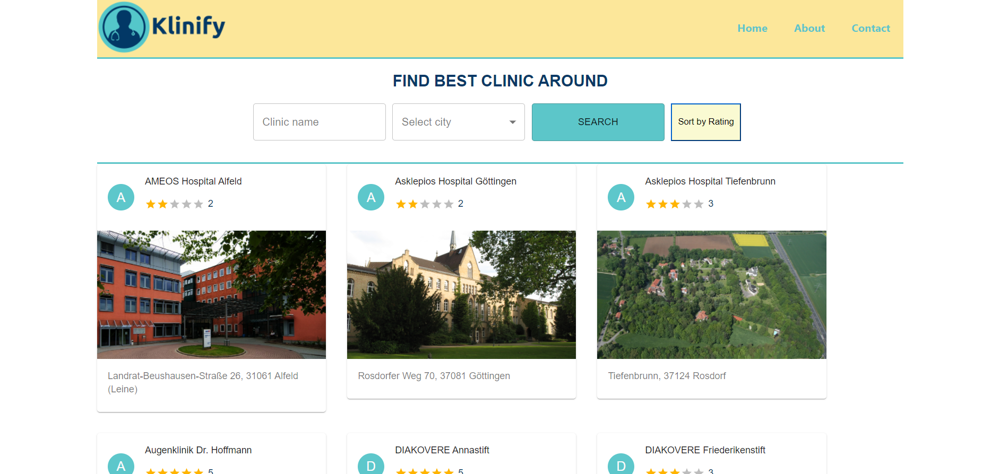

 
  
<h1 align="center">Index of React Projects</h1>

<table>
    <thead>
        <tr>
            <td>Project Name</td>
            <td>Repo Link</td>
            <td>App Link</td>
            <td>Overview</td>
        </tr>
    </thead>
    <tbody>
        <tr>
            <td>Medium MERN Clone</td>
            <td><a href="https://github.com/furkan-cloud/medium-mern-project" target="_blank">Repo details</a></td>
            <td><a href="https://medium-mern-clone.herokuapp.com/" target="_blank">Click here to see the project</a></td>
            <td></td> 
        </tr>
                <tr>
            <td>Klinify Website</td>
            <td><a href="https://github.com/furkan-cloud/hospitalwebsite" target="_blank">Repo details</a></td>
            <td><a href="https://furkan-cloud.github.io/hospitalwebsite" target="_blank">Click here to see the project</a></td>
            <td></td> 
        </tr>
</tbody>
</table>
